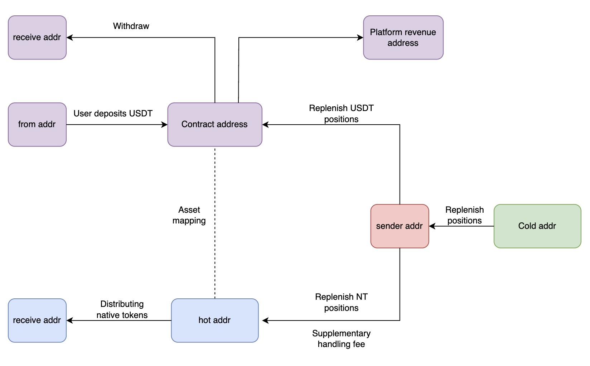
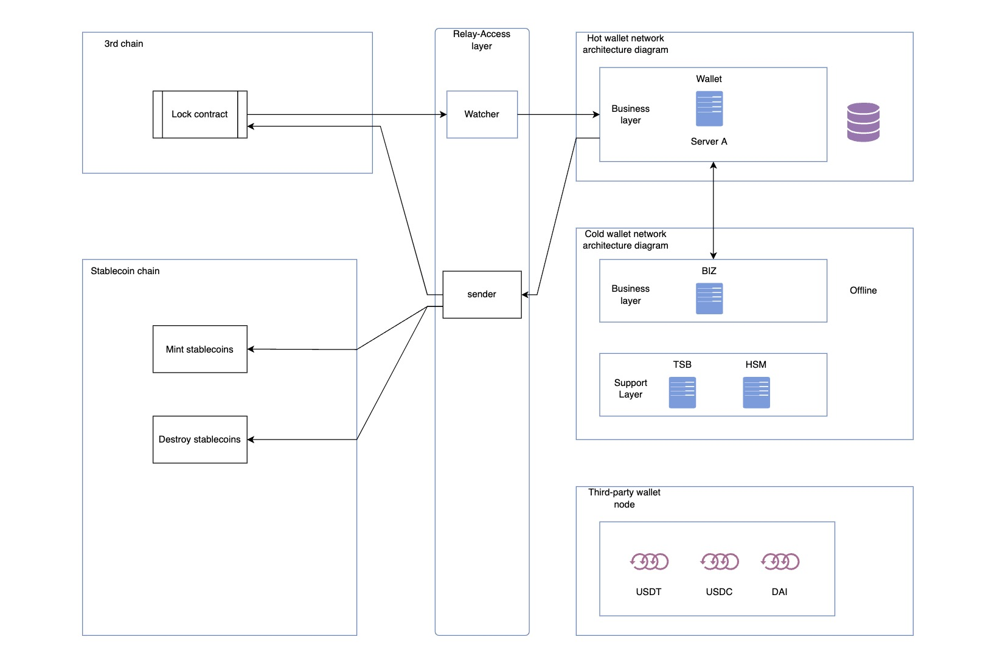
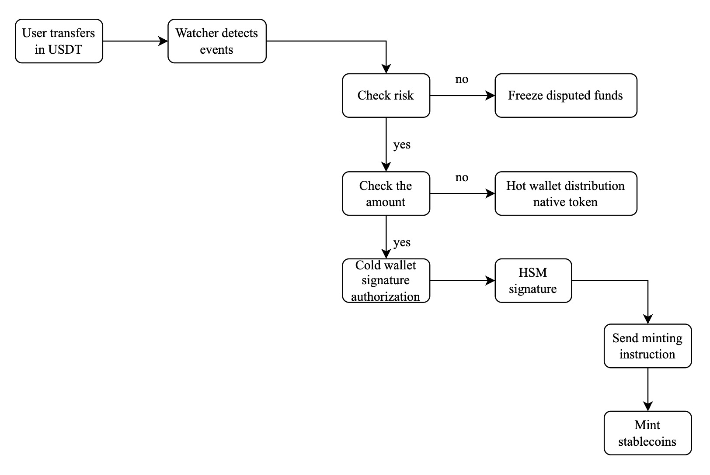
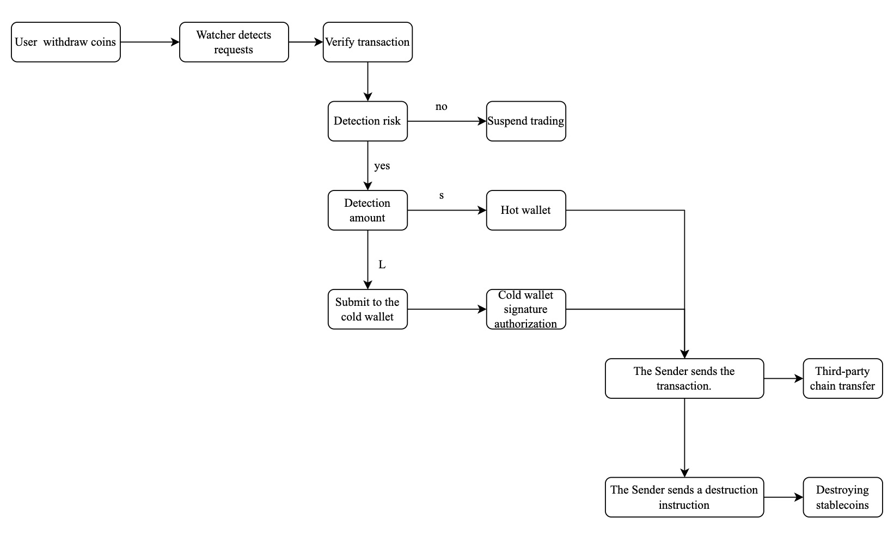
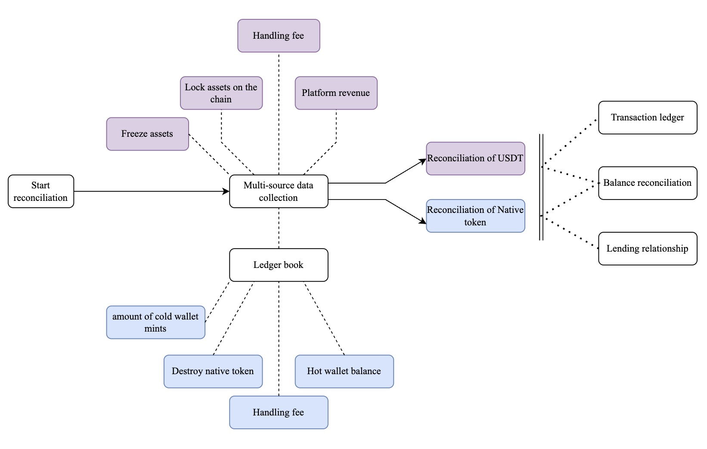
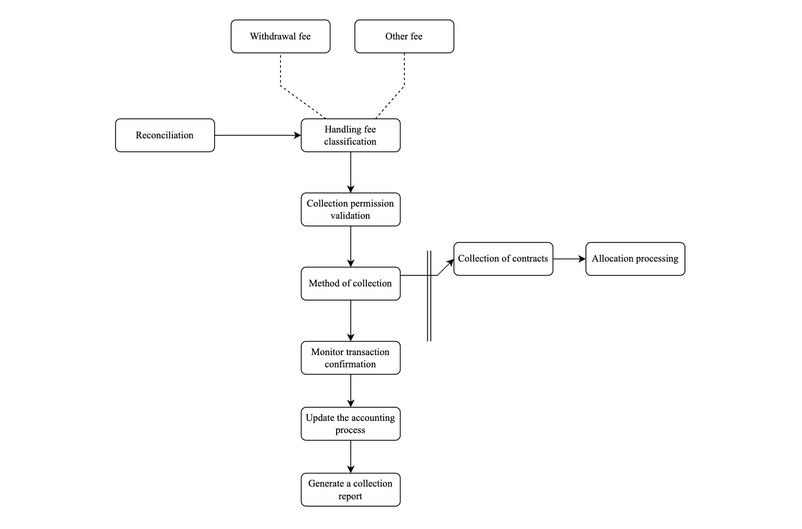
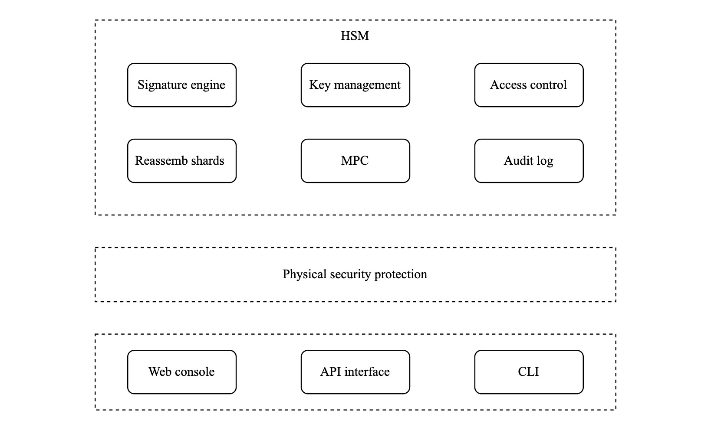
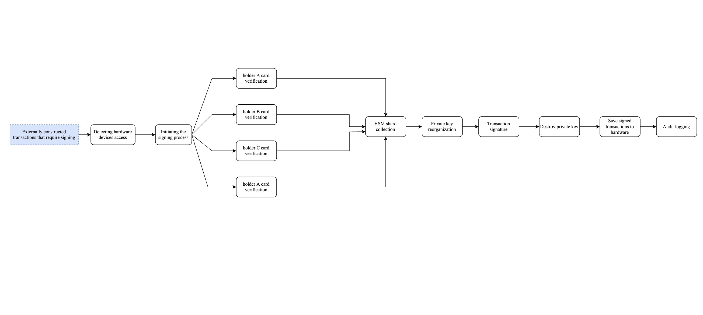

# System Overview

## Key Security Principles

- ❗ **User funds** are held in contracts on respective chains, operators cannot directly manage them
- ❗ **Cold wallets** primarily manage minting operation permissions for stablecoins and large-amount stablecoin exchange permissions
- ❗ **Hot wallets** main functions include permissions for stablecoin exchange, distribution, and destruction of regular business operations

## Fund Management

Fund flows involve reconciliation between pegged third-party stablecoins and the current stablecoin chain's Native token.

### Fund Types

**User Funds:**
- Stablecoins deposited by users (e.g., USDT)
- NT held by users

**Platform Funds:**
- USDT positions held by the platform
- NT minted by the platform

### Reconciliation Formula

```
Operator funds = Operator's own funds + Transaction fees
User funds = User's legitimate funds + Frozen funds
Fund composition = User funds + Operator funds
Deposit order funds = Withdrawal order funds + Transaction fees
```




## System Architecture

### Main Module Overview

**1. Business Layer**
- Provides external interfaces
- Request parameter validation
- API entry points
- Callback scheduled tasks
- External-related business operations

**2. Support Layer**

*HSM (Hardware Security Module):*
- Manages cold wallet private keys and addresses
- Backup and recovery operations
- Standard operational procedures
- Transaction signing

*Signing Machine:*
- Manages user addresses and positions
- Non-cold wallet address signing
- Private key management

*Wallet Nodes:*
- Official nodes and third-party nodes
- Secure and stable on-chain data queries
- Daily node maintenance

**3. Internal Access Layer**

*Cloud Service Monitoring:*
- Monitors current system status
- Ensures system stability

*Risk Control Platform:*
- Risk identification for asset activities
- Behavior analysis



## Transaction Flows

### Deposit Order Flow

**Process Overview:**
1. Users transfer USDT to locking contracts on third-party chains
2. Watcher detects fund entry and performs risk control on addresses
3. System freezes problematic funds or notifies hot wallet to record normal funds
4. If hot wallet exceeds minting quota, it requests mint permission from cold wallet
5. Finally notifies the stablecoin chain through sender to mint corresponding native tokens

**Pegged Fund Sources:**
- **User locked funds:** Typically located in contracts
- **Operator's own positions:** Located in cold wallets & hot wallets



### Withdrawal Order Flow

**Process Overview:**
1. Users initiate withdrawal requests on the stablecoin chain
2. Watcher detects the request and validates transaction legitimacy
3. System performs address risk control detection
4. Hot wallet is notified for amount verification
5. Small amounts are directly exchanged by hot wallet
6. Amounts exceeding limits require cold wallet authorization for exchange
7. Transaction is completed through sender with token destruction




## Financial Operations

### Statement Process

Automated procedures for balance of borrowing and lending.



### Reconciliation Flow

Automated program for lending balance management.



## Security Design

### Multi-Party Computation (MPC) Technology

- The cold wallet adopts **MPC (Multi-Party Computation)** technology
- Implements different tiered mechanisms based on specific signing business requirements
- Private key fragments are stored on physical hardware devices (cards)
- Operators set personal PIN codes
- Administrators configure operational permissions for the cards

### Authentication Process

During use:
1. Operators insert the card into the card reader
2. Enter the PIN code
3. Perform fingerprint authentication
4. Execute business operations

> **Audit Requirement:** All operations by any person must be recorded in the audit logs.



### Cold Wallet Signature Process

**Step-by-Step Process:**

1. **Transaction Input**
   - Operator places the transaction requiring signatures into the root directory of a USB drive

2. **Hardware Detection**
   - Cold machine automatically detects connected hardware devices
   - System initiates the signing process

3. **Card Authentication**
   - Each operator inserts their respective card
   - System automatically validates the card permissions

4. **Authorization Determination**
   - Based on the transaction type, system determines required number of authorized personnel
   - HSM host collects sufficient private key fragments to reconstruct the complete private key

5. **Transaction Signing**
   - Reconstructed private key is used to sign the transaction
   - After signing completion, the reconstructed private key is immediately destroyed

6. **Output and Logging**
   - Signing results are output
   - Complete signing process is recorded


